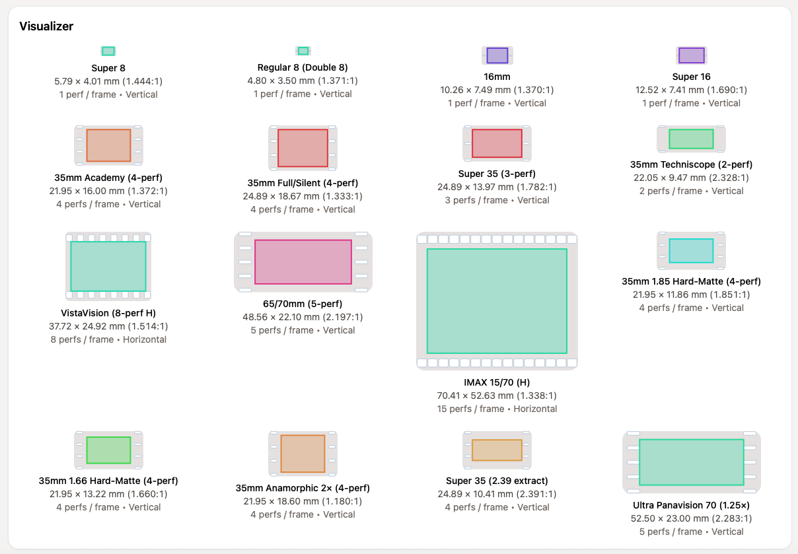
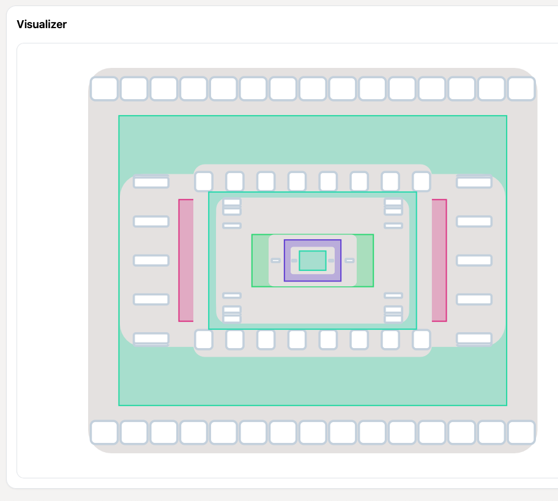

# Film Format Visualizer

Interactive visualizer comparing common motion‑picture film formats. Explore negative/gate sizes, perforations, and transport orientation across Super 8, 16mm, 35mm variants, VistaVision, 5‑perf 70mm, and IMAX 15/70.

Live demo: https://f0rmwk.github.io/film_format_visualizer/

## Preview

  
  

## Features

- Overlay and Grid views to compare formats
- Adjustable scale (px/mm), fill opacity, and outline width
- Toggle film stock and perforations
- Overlay order controls (when in Overlay): As selected, Small → Top, Large → Top
- Format selection helpers: Select all, Clear, Invert
- Editable format data (sizes, perfs, transport) with Reset to defaults
- Collapsible controls and details to reduce clutter

## Run locally

- Open `index.html` in a modern browser (Safari, Chrome, Firefox, Edge)
- Or serve the folder for a consistent environment:
  - Python: `python3 -m http.server 8000` and open `http://localhost:8000/`
  - Node: `npx serve .` and open the printed URL

## Tech

- No build step; uses React 18, ReactDOM, and Tailwind via CDNs
- JSX transpiled in‑browser using Babel Standalone
- Main component: `film_format_overlay_visualizer_interactive.jsx`

## Notes

- Dimensions are typical camera/negative image areas; projection apertures differ.
- Perforations are schematic for clarity (not exact pitch/profile).
